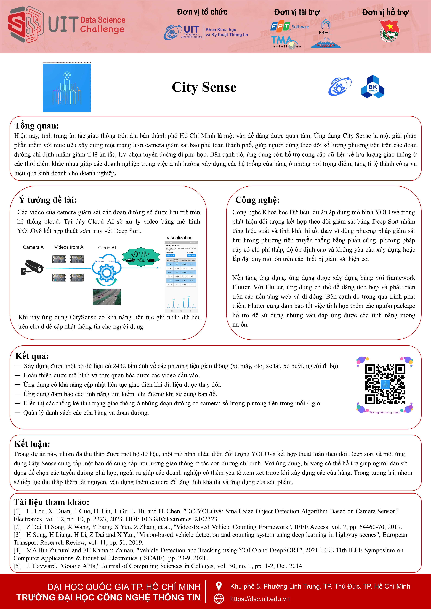

## City Sense



## Installation

To install the app, you will need to have the following installed:
```
Flutter SDK
Dart plugins
```
Once you have the required dependencies installed, you can run the following command from the root directory of your app:
```
flutter pub get
```

## Usage

To start the app, simply run the following command from the root directory of your app:
```
flutter run
```

The app allows users to monitor and manage traffic flow efficiently. Features include real-time traffic updates, route planning, and traffic density analysis.

### Yolo v8 - Deepsort - Tracking traffic

[AI Demo repo)](https://github.com/NguyenMinhMY/traffic_tracking_yolov8)

## Overview

Watch an overview of the app on YouTube: [Overview City Sense - Application for Smart City (UIT Data Science Challenge)](https://www.youtube.com/watch?v=eTg50OCdbDQ&t=63s)

## Demo

Watch a demo of the app on YouTube: [City Sense - Traffic Flow - UIT Data Science Challenge for Smart City](https://www.youtube.com/watch?v=crmS9GU8EWk&list=PL4jE5bHezhPD70zWYzIMkuCwgBfRlO1l7&index=3)

## Download

Download the app from the Google Play Store: [City Sense](https://play.google.com/store/apps/details?id=com.traffic_solution_dsc)

## Troubleshooting

If you are having problems installing or using the app, please try the following:

- Ensure you have the latest version of the [Flutter SDK](https://docs.flutter.dev/get-started/install) and all necessary plugins.
- Try restarting your device.
- For more help, visit the [Flutter documentation](https://docs.flutter.dev/).

## Additional Information

Developed by: [Manh Ho Dinh](https://github.com/ManhHoDinh) - [Trong-Ninh Nguyen](https://github.com/Ninhnon) - [Tuan-Vu Tran](https://github.com/AmosIvor) - [Minh-My Nguyen](https://github.com/NguyenMinhMY)

Contact us at: 21522327@gm.uit.edu.vn
